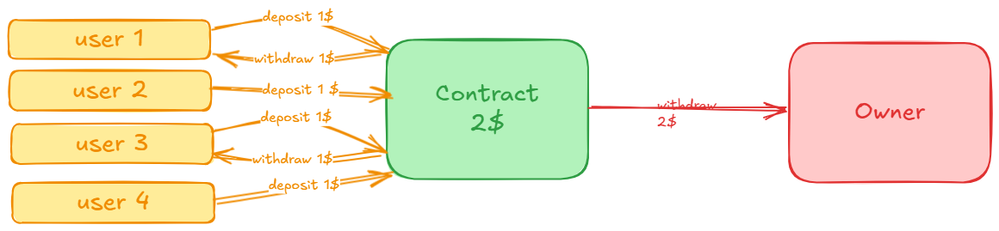

# EtherVault Contract

## Overview
EtherVault is a secure and efficient smart contract built on Solidity that allows users to deposit and withdraw Ether. The contract includes robust features such as restricted access for administrative functions, individual balance tracking, and event logging for transparency. It is a demonstration of Solidity skills and secure coding practices, showcasing your ability to design, deploy, and test smart contracts professionally.

---


## Features
- **Deposit and Withdraw**: Users can deposit Ether to the contract and withdraw their balances anytime.
- **Owner Privileges**: The contract owner has exclusive rights to withdraw all funds from the contract.
- **Event Logging**: Emits events for deposits and withdrawals to provide transaction transparency.
- **Balance Tracking**: Maintains user-specific balances securely.
- **Test Coverage**: Includes comprehensive test cases using Foundry for deposit, withdrawal, and edge-case scenarios.

---

## Deployed Contract
**Network**: Sepolia Testnet  
**Contract Address**: [0x87c625aD3269636DCfb656D9b072825015d609cF](https://sepolia.etherscan.io/address/0x87c625aD3269636DCfb656D9b072825015d609cF)

---

## Project Structure
```
EtherVault/
├── src/
│   ├── EtherVault.sol   # Main smart contract
├── test/
│   ├── EtherVault.t.sol   # Comprehensive test suite
├── README.md            # Project documentation
```

---

## Usage

### Prerequisites
- Install [Foundry](https://book.getfoundry.sh/) for Solidity development and testing.
- A funded wallet for interacting with the deployed contract on the Sepolia testnet.

### Deploy the Contract
1. Clone the repository:
   ```bash
   git clone <repository_url>
   cd EtherVault
   ```
2. Deploy the contract:
   ```bash
   forge create --rpc-url <your_rpc_url> --private-key <your_private_key> src/EtherVault.sol:EtherVault --constructor-args <owner_address>
   ```

### Interact with the Contract
- **Deposit**: Send ETH to the contract using the `deposit` function.
- **Withdraw**: Call the `withdraw` function with the desired amount.
- **Owner Withdraw All**: The contract owner can withdraw all funds using the `withdrawAll` function.

---

## Tests
The project includes a complete test suite written in Foundry to ensure correctness and security:
1. Run tests locally:
   ```bash
   forge test
   ```
2. Test cases include:
   - Initial setup validation
   - Deposit and withdrawal scenarios
   - Edge cases for invalid actions
   - Owner-specific functions

---

## Key Learnings and Highlights
- **Solidity Development**: Demonstrates proficiency in designing secure and efficient smart contracts.
- **Testing with Foundry**: Comprehensive test coverage for robust code quality.
- **Professional Practices**: Emphasis on readable code, event logging, and clear error messages.


